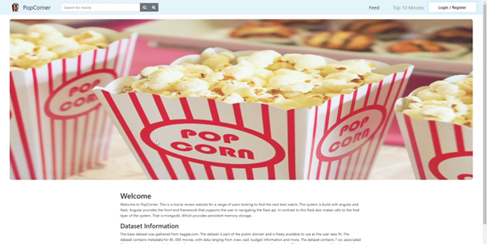
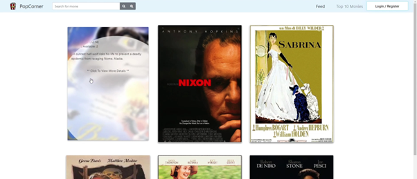
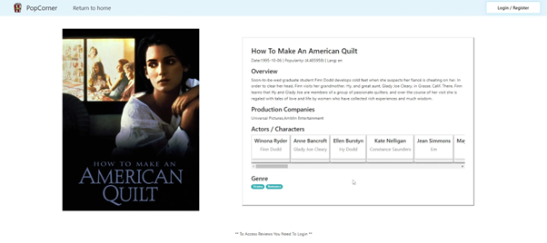
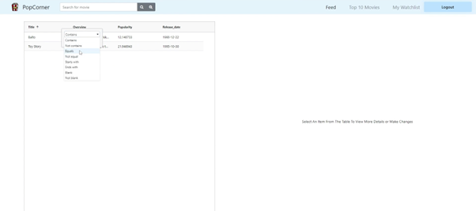

# COM661FullStackBackendAPI

The goal of this assignment was to create a full stack application. Therefore, I decided to developed a movie review webpage.
The code base is split up into two code bases COM661_FULL_STACK_FRONTEND_ANGULAR and COM661_FULL_STACK_BACKEND_API.

* The images below are not a complete outline of the system. This just provides a highlevel overview of the system.

## Home Page

## Pagination

## Movie Details

## Watchlist

# Venv Setup

- Run Command: "python -m venv venv"
- Activate: "./venv/Scripts/activate"
- Then Complete Pip commands below

# Python (Pip) Modules Dependency List

- pip install flask
- pip install pymongo
- pip install pyjwt==1.7.1
- pip install bcrypt

# End Point List

| Method | Description | Route | Access Level | Implemented
| --- | ----------- | --- | ----------- | ----------- |
| Header | Title | Header | Title | Title |
| Paragraph | Text | Header | Title | Title |
